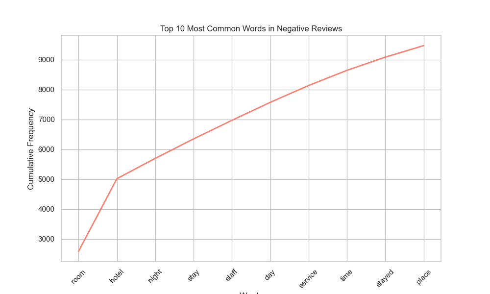
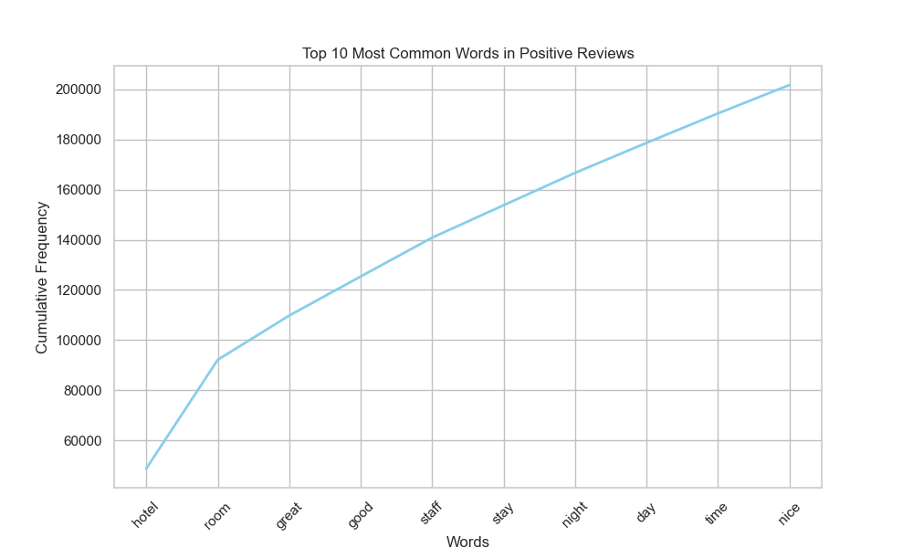
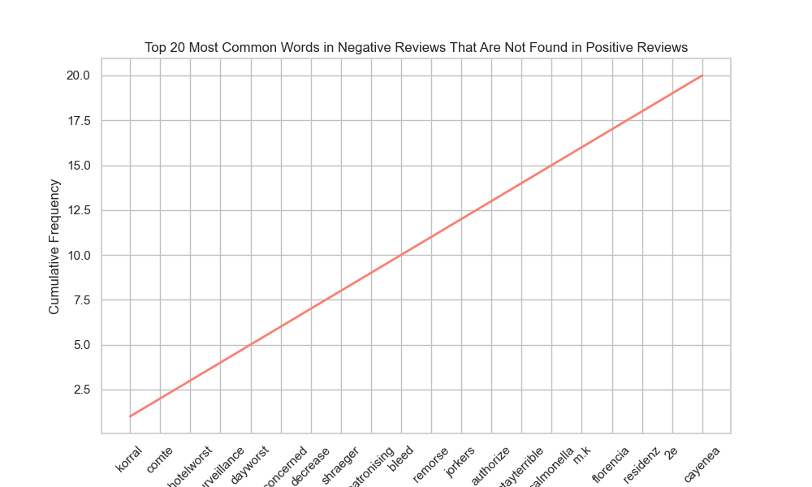
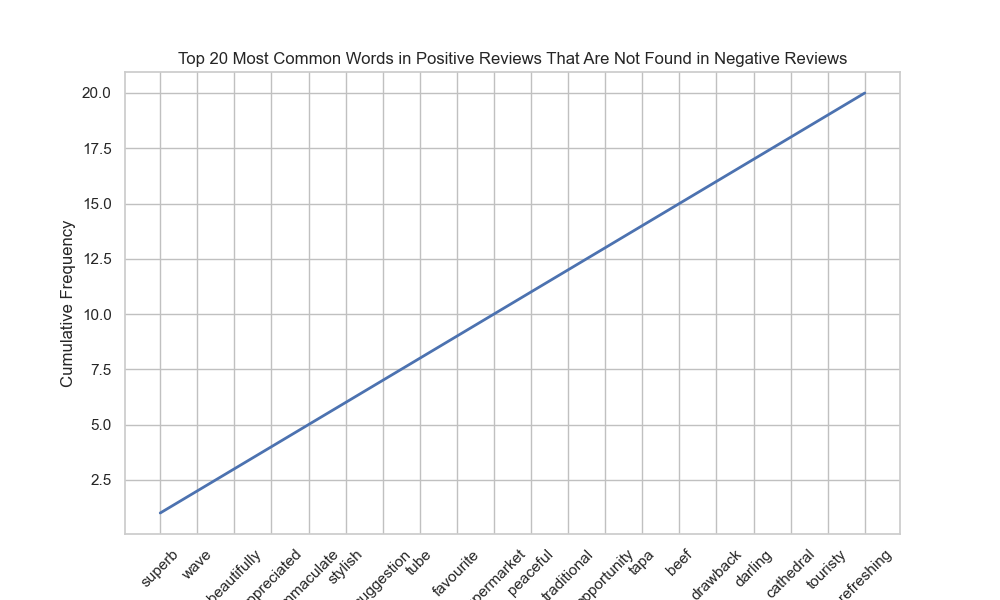

<iframe
  src="assets/Tripadvisor-Logo.png"
  width= "1000"
  height="300"
  frameborder="0"
></iframe>

# Trip Advisor Sentiment Analysis
By Ken Ogihara

## Introduction
Hotels play a huge role in the traveling industry. Hotels can make or break a traveler's experience and must allocate their resources efficiently to maintain competition. 

The dataset is taken from Kaggle and contains over 20,000 reviews and their corresponding rating. In this project, I use Natural Language Tool Kit and Sentiment Intensity Analyzer to determine the sentiment behind each hotel review. I cover questions such as, "What specific attributes make a good hotel and a bad one? In what ways could hotels improve their services based on customer reviews?" Sentiment analysis is a great way for hotels to understand their strengths and weaknesses. It provides a way for not just hotels but also businesses to perfect their strengths and to see where they fall short.

The following are the relevant libraries and packages I will work with throughout the project.

```py
import pandas as pd
import numpy as np
import matplotlib.pyplot as plt
import plotly.express as px
import plotly.graph_objects as go
import nltk
from nltk.tokenize import word_tokenize
from nltk.probability import FreqDist
from nltk.stem import WordNetLemmatizer
import string
from wordcloud import WordCloud, STOPWORDS
import seaborn as sns
from nltk.sentiment import SentimentIntensityAnalyzer
from nltk.collocations import BigramCollocationFinder
from nltk.metrics import BigramAssocMeasures

nltk.download([
    "names",
    "stopwords",
    "wordnet",
    "vader_lexicon",
])
```


This dataset contains 2 columns:

| Column Name | Description                                                   |
|-------------|---------------------------------------------------------------|
| Review      | Customer review represented as a string        |
| Rating      | Customer's rating of the hotel, on a 1-5 scale.      |

The first two rows of the dataset is shown below:

```py
reviews = pd.read_csv("/Users/kenogihara/Desktop/ALL_PROJECTS/sentiment_analysis/tripadvisor_hotel_reviews.csv")
print(reviews.head(2))
```

| Review                                                                                                                         | Rating |
|--------------------------------------------------------------------------------------------------------------------------------|--------|
| nice hotel expensive parking got good deal stay hotel anniversary, arrived late evening took advice from previous reviews...    | 4      |
| ok nothing special charge diamond member hilton decided chain shot 20th anniversary seattle, start booked suite paid extra...   | 2      |

## Exploratory Data Analysis

Univariate plot that shows the distribution of ratings.

<iframe
  src="assets/plot1.html"
  width="700"
  height="500"
  frameborder="0"
></iframe>

## Tokenization

1. **Separate all reviews from texts to words** I used nltk's word_tokenize function to represent each review into words separated by commas.

```py
reviews["tokenized"] = reviews["Review"].apply(nltk.word_tokenize)
```

2. **Filter every review by removing stopwords** I used lambda function and nltk's corpus of stopwords and punctuation from the string module to remove words that do not contribute to the sentiment of a review.

```py
stopwords = nltk.corpus.stopwords.words("english")
stopwords.extend(["n't", "did"])
punctuation = set(string.punctuation)

reviews["tokenized"] = reviews["tokenized"].apply(
    lambda review: [word for word in review if word not in stopwords and word not in punctuation])
  ```

The dataframe now has a third column that contains the tokenized version:

| Review                                                                                                                                  | Rating | Tokenized                                                                                                                                                                                                                                            |
|-----------------------------------------------------------------------------------------------------------------------------------------|--------|-------------------------------------------------------------------------------------------------------------------------------------------------------------------------------------------------------------------------------------------------------|
| nice hotel expensive parking got good deal stay hotel anniversary, arrived late evening took advice from previous reviews did valet...   | 4      | [nice, hotel, expensive, parking, got, good, deal, stay, hotel, anniversary, arrived, late, evening, took, advice, previous, reviews, did, valet]                                                                                                     |
| ok nothing special charge diamond member hilton decided chain shot 20th anniversary seattle, start booked suite paid extra website...   | 2      | [ok, nothing, special, charge, diamond, member, hilton, decided, chain, shot, 20th, anniversary, seattle, start, booked, suite, paid, extra, website]                                                                                                 |
  
## Frequency Distribution, Lemmatizer, and Style Cloud

To analyze a frequency distribution of all words, we must store all the words in one long string. The process is simple:

- **Step 1:** Store all words in a variable called, `all_words`.

```py
all_words = " ".join([word for token_list in reviews["tokenized"] for word in token_list])
```

- **Step 2:** Tokenize all the words in the string and store it in `tokenized_all_words`.

```py
tokenized_all_words = nltk.tokenize.word_tokenize(all_words)
```

- **Step 3:** Create an instance of a frequency distribution from the list of `tokenized_all_words` and apply the instance to the tokenized column using lambda function to filter out all words that occur only *once* in the entire dataset.

```py
frequency_dist = FreqDist(tokenized_all_words)

reviews["fdist"] = reviews["tokenized"].apply(lambda text: " ".join([word for word in text if frequency_dist[word] > 1]))
```

Words that rarely appear may be less informative or relevant to the overall sentiment of the reviews. Filtering out these words reduces noise.

#### Lemmatizer

**Step 4:** Create an instance of a word net lemmatizer and use apply function to tokenized frequency distribution column to transform all words to their base form. 

```py
wordnet_lem = WordNetLemmatizer()
reviews["fdist_tokenized"] = reviews["fdist"].apply(nltk.word_tokenize)
reviews["lemmatized"] = reviews["fdist_tokenized"].apply(lambda tokens: " ".join(wordnet_lem.lemmatize(token) for token in tokens))
```

Next, I check if each column are equal to each other to ensure that the function actually worked.

```py
reviews["is_equal"] = (reviews["fdist"] == reviews["lemmatized"])
print(reviews["is_equal"] = (reviews["fdist"] == reviews["lemmatized"])
)
```

| Value  | Count |
|--------|-------|
| False  | 19921 |
| True   | 570   |

The table shows that 19,921 reviews are able to be lemmatized. In other words, these reviews contain words that are not in their base form.

#### Style Cloud

**Step 5:** In this section, I put all lemmatized reviews in a single string called, `all_words_lem` in order to generate a style cloud of the most frequently used words.

```py
all_words_lem = " ".join([word for word in reviews["lemmatized"]])
fp = '/Users/kenogihara/Desktop/ALL_PROJECTS/sentiment_analysis/assets/all_words_lem.txt'

with open(fp, 'w') as file:
    file.write(all_words_lem)

bookreader = sc.gen_stylecloud(
    file_path = fp,
    size = 600,
    icon_name = "fas fa-book-reader",
    palette = 'colorbrewer.sequential.Blues_5',
    background_color = 'white',
    output_name = '/Users/kenogihara/Desktop/ALL_PROJECTS/sentiment_analysis/assets/all_words_lem.png')
```
<iframe
  src="assets/all_words_lem.png"
  width="1100"
  height="500"
  frameborder="0"
></iframe>


The size of each word shows how common they occur throughout the text. We can see that words like, "hotel", "room", "resort", "people", and "day" are the most used. The following graph shows the top ten most frequently used words in this dataset.

<iframe
  src="assets/plot2.html"
  width="700"
  height="500"
  frameborder="0"
></iframe>

As expected, the top ten most frquently used words tend to be the biggest words in the style cloud. However, words like "hotel", "room", "staff", and "stay" are nouns that don't convey much sentiment. In another words, these words are likely to be found in both positive and negative reviews. Therefore the entire process of using tokenization, lemmatization, and style cloud is insufficient to convey the tone of this dataset. 

## Sentiment Intensity Analyzer

In this section, I create an instance of a Sentiment Intensity Analyzer from the VADER lexicon and use the `polarity.scores` function to determine the sentiment of each review. 

```py
analyzer = SentimentIntensityAnalyzer()
reviews["polarity"] = reviews["lemmatized"].apply(lambda x: analyzer.polarity_scores(x))
reviews = pd.concat([reviews, reviews["polarity"].apply(pd.Series)], axis = 1)
print(reviews.head(2)[["Review", "neg", "neu", "pos", "compound"]]
)
```

| Review                                                       | neg   | neu   | pos   | compound |
|---------------------------------------------------------------|-------|-------|-------|----------|
| nice hotel expensive parking got good deal sta...             | 0.056 | 0.621 | 0.324 | 0.9808   |
| ok nothing special charge diamond member hilto...             | 0.054 | 0.695 | 0.251 | 0.9946   |

`polarity_scores` outputs the proportion of the text that's negative, positive and neutral, as well as the *compund*, which is a metric that ranges from -1 to +1, where the closer it is to +1 the more positive the sentiment is, and the closer it is to -1 the more negative the sentiment is.

*compound* is calculated from the following steps:

- Summing up all the sentiment scores that VADER lexicon imputes to each word. These scores range from -4 to +4, where +4 is assigned to the most positive word and vice versa.
Let's say this number is stored in `sum_sentiment_scores`.

- The sum of the sentiment scores is then normalized by dividing `sum_sentiment_scores` by `sqrt(sum_sentiment_scores**2 + alpha)` where alpha == 15.

<iframe
  src="assets/plot3.html"
  width="700"
  height="500"
  frameborder="0"
></iframe>

For the sake of my analysis, a positive review is one whose compound score is >= 0.05, a negative review is one whose compound score is <= -0.05, and negative otherwise.

```py
reviews["sentiment"] = reviews["compound"].apply(lambda x: "positive" if x >= 0.05 else "negative" if x <= -0.05 else "neutral")

data = reviews.groupby("sentiment").count().reset_index()
fig = px.pie(data, names = "sentiment", values = "Review")
fig.show()
```
<iframe
  src="assets/plot4.html"
  width="700"
  height="500"
  frameborder="0"
></iframe>

<iframe
  src="assets/plot5.html"
  width="700"
  height="500"
  frameborder="0"
></iframe>

I mentioned earlier that words like "hotel", "resort", "stay" or "night" are commonly used in both positive *and* negative reviews. Frequency distributions of each group of sentiments will still show similar words:





The solution is found by removing common words from each list. In other words, filter out all the words in the most common words found in the negative frequency distribution if that word is *also* found in the positive frequency distribution and vice versa.





Notice the words in each graph. For the negative reviews, the most common words are "korral", "comte", "surveillance", etc...

For the positive reviews, most frequently used words are "superb", "wave". "beautifully", "immaculate", etc...

It is important to note that these words don't really encapsulate ways in which hotels can improve upon their services. After all, what can a hotel do about "korral" or "surveillance"? What exactly about the surveillance causes such negative sentiment towards the hotel? We cannot determine specific ways to improve hotel services if we do not understand the context of the reviews that contain words such as "surveillance."

### Concordance

NLTK's **concordance** function shows the context of a specified word within the text. For example, I'd have a better understanding of people's bad experiences at hotels if I use the keyword, "bad". This is what I will do in this section.

**Step 1:** I first define `get_concordance_text` function that has two parameters: `text_blob` and `word`. It returns a string that contains every occurrence of the keyword and its context. The function is shown below:

```py
def get_concordance_text(text_blob, word):
    output = ""
    concordance_list = text_blob.concordance_list(word, lines = None)
    for i in range(len(concordance_list)):
        # We use 4 and 6 here because these entries contain the context of the keyword represented as a string.
        for j in range(4, 6):
            output += " " + concordance_list[i][j]
    return output
```

**Step 2:** Create a list of keywords and use my `get_concordance_text` function to find all the context of every occurence of each keyword.

```py
pos_text_blob = nltk.Text(pos_words)
keywords = ["good", "awesome", "wonderful", "beautiful", "great"]
pos_text_with_keywords = " ".join([get_concordance_text(pos_text_blob, word) for word in keywords])

neg_text_blob = nltk.Text(neg_words)
keywords = ["bad", "terrible", "horrible", "horrendous", "poor", "unsatisfied"]
neg_text_with_keywords = " ".join([get_concordance_text(neg_text_blob, word) for word in keywords])
```

Here is the stylecloud for positive and negative statements after we have filtered out common words:

<iframe
  src="assets/pos_text_with_keywords.png"
  width="1100"
  height="500"
  frameborder="0"
></iframe>

<iframe
  src="assets/neg_text_with_keywords.png"
  width="1100"
  height="500"
  frameborder="0"
></iframe>

## Conclusion

After I eliminated common words like "hotel", "room", or "day", I have a better understanding of what words or experiences are associated with
positive reviews and negative reviews.

For example, applying concordance on positive words shows that people like the location, food, beach, restaurant, staff, bed, and pool. Applying concordance on negative words, on the other hand, shows that people
have a negative sentiment toward food, service, staff, cleanliness, breakfast, smell, quality, noise, and bathroom. This gives insight into what hotels
should be working on to satisfy their customers.